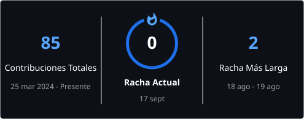

# Cristian David Gutiérrez

### Software · Automatización · Operaciones

Construyo sistemas que convierten procesos operativos reales en flujos digitales más trazables, verificables y mantenibles.

---

## Sobre mí

Trabajo en la intersección entre **operaciones** y **tecnología**: identifico necesidades de proceso y las convierto en software, automatización y formas de trabajo más trazables.

Mi enfoque actual incluye desarrollo de productos internos, automatización de tareas repetitivas, calidad de entrega, documentación técnica y construcción de **Gutierrez Systems** como entorno tecnológico corporativo separado de mi identidad personal.

---

## Stack tecnológico

---

## Trabajo seleccionado

<table>
<tr>
<td width="50%" valign="top">

### GS ContractOps

Plataforma de Gutierrez Systems en descubrimiento y diseño para estructurar la **planeación, ejecución, trazabilidad y supervisión de contratos con operación en campo**.

**Estado:** discovery / fundación técnica.

</td>
<td width="50%" valign="top">

### EMINSER — Cierre de Nómina

Aplicación operativa privada para apoyar flujos mensuales de **asistencia, novedades y revisión de nómina**.

**Stack:** Next.js · TypeScript · React · Supabase

</td>
</tr>
<tr>
<td width="50%" valign="top">

### GS Document Verification

Producto privado orientado a **verificación documental y generación de dossiers**, con separación entre frontend, backend y controles técnicos de manejo de información.

</td>
<td width="50%" valign="top">

### Aquality — colaboración externa

Colaboración técnica verificable en un proyecto externo. El repositorio **no pertenece a Gutierrez Systems**.

[Ver Aquality en GitHub](https://github.com/Parra9510/aquality)

</td>
</tr>
</table>

---

## Actividad en GitHub

> La actividad visible en el perfil puede no representar todo el trabajo realizado, ya que parte de los proyectos de Gutierrez Systems son privados.

---

## Principios de ingeniería

- ✅ **Seguridad por defecto.** Secretos fuera del repositorio y exposición mínima de datos sensibles.
- ✅ **Entrega trazable.** Cambios importantes mediante rama → Pull Request → checks → `main`.
- ✅ **Evidencia verificable.** No presentar métricas, productos o resultados sin respaldo.
- ✅ **Software mantenible.** Documentación y estructura suficientes para que otra persona pueda comprender el sistema.
- ✅ **Problemas reales primero.** Cada sistema debe responder a una necesidad operativa concreta.

---

## Gutierrez Systems

### Software · Automatización · QA · Operaciones digitales

Desarrollo **Gutierrez Systems** como entorno corporativo para productos, ingeniería, automatización, calidad y conocimiento técnico.

---

## Contacto

- **GitHub:** [@GCrist1an](https://github.com/GCrist1an)
- **Correo:** [cdgutierrez00@gmail.com](mailto:cdgutierrez00@gmail.com)
- **Web personal:** [Cristian Gutierrez](https://cristian-gutierrez-web.vercel.app/)
---

Este perfil presenta únicamente proyectos, enlaces y afirmaciones respaldados por repositorios o documentación verificable.
